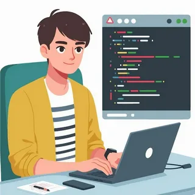

# Портфолио начинающего Full-Stack разработчика (Python)

Приветствую! Я начинающий Full-Stack разработчик на Python, который активно углубляет свои знания в процессе обучения. Моя главная цель сейчас — нарабатывать практику, писать чистый код и перенимать лучший опыт.
## 🛠 Технологический стек
_Основной язык_: Python

_Контроль версий_: Git, GitHub

_В процессе изучения и применения_: Telegram Bot API
## 💻 Текущий проект
Telegram-бот для управления задачами (To-Do List)

*Статус*: В активной разработке.

*Идея*: Бот для создания задач и настройки напоминаний с разной периодичностью (на день, неделю, месяц, год).

*Чему я учусь на этом проекте*: Структурированию данных, работе с внешними API и проектированию логики приложения.
## 🎯 Мой подход к работе и обучению
1. Внимательность к деталям: Стараюсь писать читаемый и логичный код, проверяю граничные условия.
2. Открытость к развитию: Заинтересован в изучении новых инструментов и подходов.
3. Работа с фидбеком: Искренне рад конструктивной критике, так как считаю её лучшим способом роста. Всегда готов подробно ответить на вопросы по своему коду и объяснить принятые решения.
## 📬 Контакты
Буду рад обсудить мои учебные проекты и получить обратную связь.
*GitHub*: [https://github.com/voxler988-droid]

